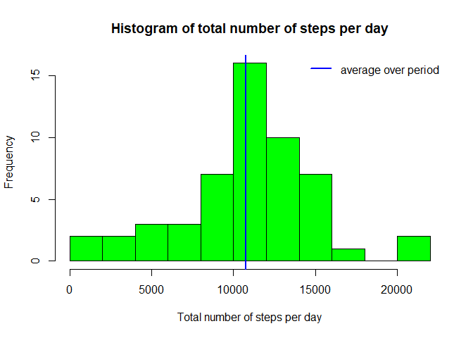
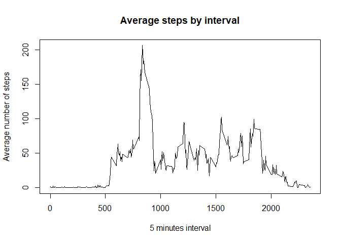
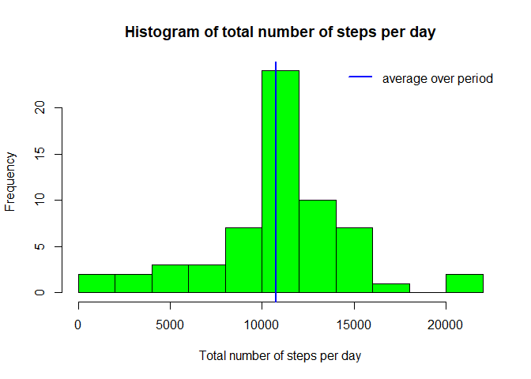
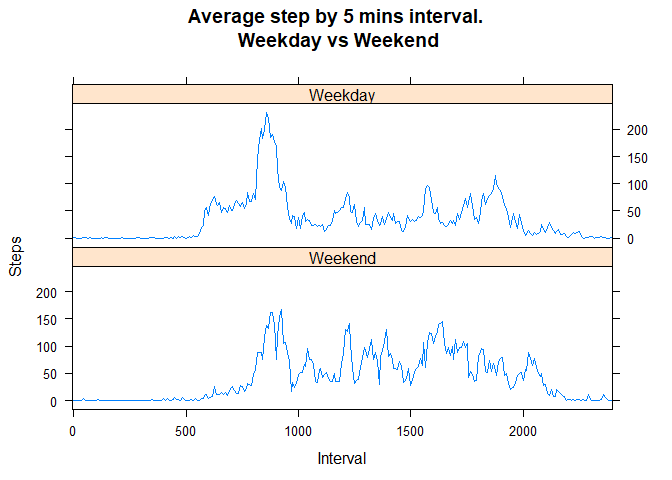

The purpose of this document is to load the data contained in the 'activity.zip' data file. According to the documentation from the data file, it contains *two months of data from an anonymous individual collected during the months of October and November, 2012 and include the number of steps taken in 5 minute intervals each day*. Once the data is loaded and adjusted, we want to answer some specific questions and make some operations, mainly:

* What is mean total number of steps taken per day?  
* What is the average daily activity pattern?  
* Imputing missing values  
* Are there differences in activity patterns between weekdays and weekends?  

Before we get started, we need to load a few libraries

```
## 
## Attaching package: 'dplyr'
```

```
## The following objects are masked from 'package:stats':
## 
##     filter, lag
```

```
## The following objects are masked from 'package:base':
## 
##     intersect, setdiff, setequal, union
```


## Loading and preprocessing the data
The first step is of course to open the data set and have a few peeks at it's content.


```r
activities <- read.csv(unz('activity.zip', 'activity.csv'))
head(activities)
```

```
##   steps       date interval
## 1    NA 2012-10-01        0
## 2    NA 2012-10-01        5
## 3    NA 2012-10-01       10
## 4    NA 2012-10-01       15
## 5    NA 2012-10-01       20
## 6    NA 2012-10-01       25
```

```r
str(activities)
```

```
## 'data.frame':	17568 obs. of  3 variables:
##  $ steps   : int  NA NA NA NA NA NA NA NA NA NA ...
##  $ date    : Factor w/ 61 levels "2012-10-01","2012-10-02",..: 1 1 1 1 1 1 1 1 1 1 ...
##  $ interval: int  0 5 10 15 20 25 30 35 40 45 ...
```


Given the questions that we have to answer, one can see that this data doesn't need much cleanup.
Actually, it would make more sense if the interval was considered as a factor rather than an integer and we'll want 
the date to actually be a date rather than text. Also, our first intuition would be to remove the missing values 
but we'll actually keep as they'll be taken care off later on.


```r
activities$interval <- as.factor(activities$interval)
activities$date <- as.Date(activities$date)
```


## What is mean total number of steps taken per day?

Our first interogation is the mean total number of steps by day. By running this code,


```r
t=split(activities$steps, activities$date) %>%
    mapply(sum, .) %>%
    summary(.) %>%
    .[c('Mean','Median')]
```

One can see the mean is 10766 while the median is 10765. But let's look at the data:


```r
mapply(sum,split(activities$steps, activities$date)) %>%
    hist(., main='Histogram of total number of steps per day', 
         xlab = 'Total number of steps per day', col='green', breaks=10)
    abline(v=t['Mean'], col='blue',lwd=2)
    legend('topright', col='blue',legend='average over period', lwd=2, bty='n')
```

<!-- -->

In this case the mean and median are too close so we didn't draw both lines.

## What is the average daily activity pattern?

Now we want to see if there's any pattern during the day. This will be done by looking at the five minutes intervals
every day for the whole period. Now in order to have meaningfull information, we must remove missing values from our data when calculating the mean.


```r
mapply(mean,split(activities$steps, activities$interval), na.rm=T) %>%
    plot(x=names(.),y=.,type='l', main='Average steps by interval', xlab='5 minutes interval', 
         ylab='Average number of steps')
```

<!-- -->

One can see that on average, the maximum number of steps is between 8am and 9am, Let's confirm this:

```r
t <- mapply(mean,split(activities$steps, activities$interval), na.rm=T) %>%
    .[.==max(.)]
```

And we can see the maximum is at 8:35.


## Imputing missing values
Now there's actually a lot of missing values. In fact, there's 2304 entries with missing values.

We chose to preserve the average steps by time interval intact so we'll create a new dataset where we'll replace the missing values by the average steps by time interval.


```r
no_empty<-activities
t=mapply(mean,split(activities$steps, activities$interval), na.rm=T)
no_empty[is.na(no_empty$steps),1] <- 
    mapply(function(x){t[x]},no_empty[is.na(no_empty$steps),'interval'])
```

Now we'll reproduce the steps from our previous first question but with the `no_empty` dataset to see if there's any difference without any missing entries.


```r
t=split(no_empty$steps, no_empty$date) %>%
    mapply(sum, .) %>%
    summary(.) %>%
    .[c('Mean','Median')]
```

We can see the mean is 10766 while the median is 10766. So the mean was affected by the introduction of filling inputs but the median stayed the same which could be expected. Now let's look if the frequency was affected:


```r
mapply(sum,split(no_empty$steps, no_empty$date)) %>%
    hist(., main='Histogram of total number of steps per day', 
         xlab = 'Total number of steps per day', col='green', breaks=10)
    abline(v=t['Mean'], col='blue',lwd=2)
    legend('topright', col='blue',legend='average over period', lwd=2, bty='n')
```

<!-- -->

As one could expected, no frequency was affected except the one containing the mean number of steps per day.

## Are there differences in activity patterns between weekdays and weekends?

Lastly, we want to see if there's any difference between weekdays and weekends. To do this, we'll use the dataset without any missing values, `no_empty`. First, we want to identify which days are weekday and which are weekends.


```r
no_empty$is_weekend <- factor(mapply(weekdays, no_empty$date, abbreviate=TRUE) 
                              %in% c('Sat','Sun'), levels = c(TRUE,FALSE),
                              labels = c('Weekend','Weekday'))
```

Now well make to linegraphs to compare the daily trends between weekdays and weekends:


```r
t <- mapply(function(x){mapply(mean, split(x$steps, x$is_weekend))},
            split(no_empty,no_empty$interval))
t <- as.data.frame(as.table(t))
colnames(t) <- c('Day','Interval','Steps')
interval.f = factor(t$Interval)
xyplot(
    Steps~Interval|Day,
    data=t, 
    type='l', 
    scales = list(
        x = list(
            at=seq(1,300,60)
        )
    ),
    layout = c(1,2),
    main = "Average step by 5 mins interval.\n Weekday vs Weekend"
)
```

<!-- -->

